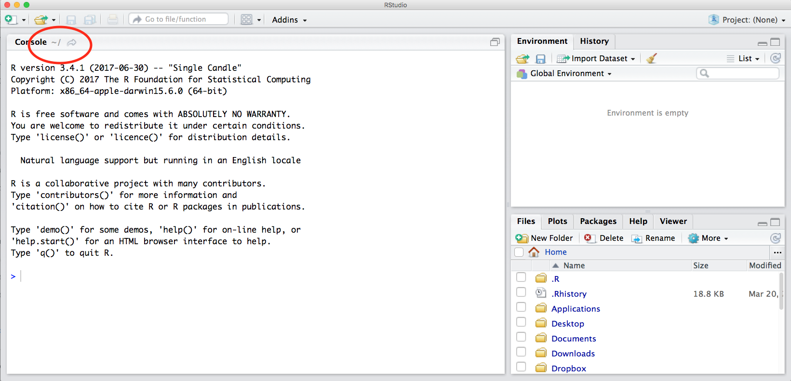
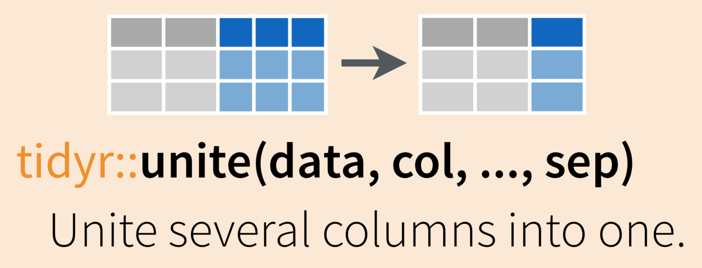

```{r setup, include=FALSE}
knitr::opts_chunk$set(echo = TRUE)
```

&nbsp;
&nbsp;

# Importing, Reformatting and Tidying Data in R

This lesson was adapted from the course [R for Excel Users](https://github.com/rstudio-conf-2020/r-for-excel) by Julia Stewart Lowndes and Allison Horst


&nbsp;
&nbsp;

### Objectives

In this session we'll learn some tools to import data into R and help make data **tidy** and more coder-friendly. Those include:

- Practice data import to R
- Use `tidyr::pivot_wider()` and `tidyr::pivot_longer()` to reshape data frames
- `janitor::clean_names()` to make column headers more manageable
- `tidyr::unite()` and `tidyr::separate()` to merge or separate information from different columns
- Detect or replace a string with `stringr` functions
- Use `dplyr::filter()` to conditionally subset our data by rows, and
- Use `dplyr::*_join()` functions to merge data frames together


### Resources

- [Ch. 12 *Tidy Data*, in R for Data Science](https://r4ds.had.co.nz/tidy-data.html) by Grolemund & Wickham
- [Jenny Bryan's Intro to Tidy Data](https://github.com/jennybc/lotr-tidy/blob/master/01-intro.md)
  - the repo this links to has some useful exercises too, but uses the older `spread()` and `gather()` functions.
- `tidyr` [vignette on tidy data](https://cran.r-project.org/web/packages/tidyr/vignettes/tidy-data.html).
- [Hadley's paper on tidy data](https://vita.had.co.nz/papers/tidy-data.pdf) provides a thorough investigation.


### Prerequisites

Before the class, please make sure you have done the following:

1. **Download and install R and RStudio**
    - R: <https://cloud.r-project.org/>
    - RStudio: <http://www.rstudio.com/download> 
    - Follow your operating system's normal installation process
&nbsp;

2. **Download workshop data ([details about the data sources here](https://github.com/rstudio-conf-2020/r-for-excel/blob/master/index.Rmd))** 
    - Google Drive folder: [r-for-excel-data ](https://drive.google.com/drive/folders/1RywSUw8hxETlROdIhLIntxPsZq0tKSdS?usp=sharing)
    - Save it temporarily somewhere you will remember; we will move it together
    


&nbsp;
&nbsp;

## Set-up

### RStudio Orientation

What is the RStudio IDE (integrated development environment)? The RStudio IDE is software that greatly improves your R experience. 

I think that **R is your airplane, and the RStudio IDE is your airport**. You are the pilot, and you use R to go places! With practice you'll gain skills and confidence; you can fly further distances and get through tricky situations. You will become an awesome pilot and can fly your plane anywhere. And the RStudio IDE provides support! Runways, communication, community, and other services that makes your life as a pilot much easier. It provides not only the infrastructure but a hub for the community that you can interact with. 

To launch RStudio, double-click on the RStudio icon. Launching RStudio also launches R, and you will probably never open R by itself. 

```{r, echo=FALSE, out.width="80%"}
knitr::include_graphics("img/RStudio_IDE.png")  
```

Notice the default panes:

  * Console (entire left)
  * Environment/History (tabbed in upper right)
  * Files/Plots/Packages/Help (tabbed in lower right)

We won't click through this all immediately but we will become familiar with more of the options and capabilities throughout the next few days.

Something critical to know now is that you can make everything you see BIGGER by going to the navigation pane: View > Zoom In. Learn these keyboard shortcuts; being able to see what you're typing will help avoid typos & help us help you.


<!---
FYI: you can change the default location of the panes, among many other things: [Customizing RStudio](https://support.rstudio.com/hc/en-us/articles/200549016-Customizing-RStudio). 
--->

An important first question: **where are we?** 

If you've have opened RStudio for the first time, you'll be in your Home directory. This is noted by the `~/` at the top of the console. You can see too that the Files pane in the lower right shows what is in the Home directory where you are. You can navigate around within that Files pane and explore, but note that you won't change where you are: even as you click through you'll still be Home: `~/`. 

```{r, echo=FALSE, out.width="80%"}
  
```

&nbsp;

### Using R

If you're not familiar with R and RStudio, there are lots of excellent tutorials online, including

- [Chapter 3 from the R for Excel course by Lowndes and Horst](https://rstudio-conf-2020.github.io/r-for-excel/rstudio.html)
- [Data Carpentry's Introduction to R lesson](https://datacarpentry.org/R-ecology-lesson/)

&nbsp;

### Installing and attaching packages

First we need to make sure that we have all the packages we will need for today's tutorial
    - `tidyverse`
    - `here`
    - `janitor` 
    - `readxl` 

Run the following lines of code in RStudio if you don't already have these packages installed
```{r, eval = FALSE}
# Install packages
install.packages("tidyverse")
install.packages("janitor")
install.packages("here")
install.packages("readxl")
```

Now to make each package accessible in our session, we'll have a attach them with the following code (`library(package_name)`):
```{r, message = FALSE, warning = FALSE}
# Attach packages
library(tidyverse)
library(janitor)
library(here)
library(readxl)
```
&nbsp;
&nbsp;

### Starting a project in RStudio

R has a powerful notion of the __working directory__. This is where R looks for files that you ask it to load, and where it will put any files that you ask it to save. RStudio shows your current working directory at the top of the console:

```{r, echo = FALSE, out.width = "50%"}
knitr::include_graphics("screenshots/rstudio-wd.png")
```

And you can print this out in R code by running `getwd()`:

```{r eval = FALSE}
getwd()
#> [1] "/Users/hadley/Documents/r4ds/r4ds"
```

It is beyond the scope of this tutorial to cover how relative and absolute paths work in R, but there is a great description [in Chapter 7 of Grolemund and Wickham's book R for Data Science](https://r4ds.had.co.nz/workflow-projects.html). The rest of this section is adapted from this chapter.

In this tutorial, we will create an RStudio project to make sure we keep everything in one place. 

Click File > New Project, then:

```{r, echo = FALSE, out.width = "50%"}
knitr::include_graphics("screenshots/rstudio-project-1.png")
knitr::include_graphics("screenshots/rstudio-project-2.png")
knitr::include_graphics("screenshots/rstudio-project-3.png")
```

Call your project `r4ds` and think carefully about which _subdirectory_ you put the project in. If you don't store it somewhere sensible, it will be hard to find it in the future!

Once this process is complete, you'll get a new RStudio project just for this tutorial. Check that the "home" directory of your project is the current working directory:

```{r eval = FALSE}
getwd()
#> [1] /Users/hadley/Documents/r4ds/r4ds
```

Whenever you refer to a file with a relative path it will look for it here. Now in your favorite OS-specific way, unzip the folder you downloaded with data files and copy it into the project folder so that we can easily find it.


&nbsp;
&nbsp;


## Importing data into R

In this section, we'll learn how to read some external data (from .xls, .xlsx, and CSV files) into R with the `readr` and `readxl` packages (both part of the `tidyverse`). 

### Resources

- [https://readr.tidyverse.org/](`readr` documentation) from tidyverse.org
- [https://readxl.tidyverse.org/](`readxl` documentation) from tidyverse.org
- [https://readxl.tidyverse.org/articles/articles/readxl-workflows.html](`readxl` workflows article) from tidyverse.org

## Read in .xlsx and .csv files 

We'll start by reading in data for parks visitation from two files: 

- A comma-separated-value (CSV) file containing visitation data for all National Parks in California (ca_np.csv)
- A single Excel worksheet containing only visitation for Channel Islands National Park (ci_np.xlsx)

### `read_csv()` to read in comma-separated-value (.csv) files

There are many types of files containing data that you might want to work with in R. A common one is a comma separated value (CSV) file, which contains values with each column entry separated by a comma delimiter. CSVs can be opened, viewed, and worked with in Excel just like an .xls or .xlsx file - but let's learn how to get data directly from a CSV into R where we can work with it more reproducibly. 

To read in the ca_np.csv file, we need to: 


- use `read_csv()` to read in the file
- assign the stored data an object name (we'll store ours as ca_np)

```{r message=FALSE}
ca_np <- read_csv("data/ca_np.csv")
```

Look in your Environment to see that **ca_np** now shows up. Click on the object in the Environment, and R will automatically run the `View()` function for you to pull up your data in a separate viewing tab. Now we can look at it in the spreadsheet format we're used to. 

We can explore our data frame a bit more to see what it contains. For example: 

- `names()`: to see the variable (column) names
- `head()`: to see the first *x* rows (6 is the default)
- `summary()`: see a quick summary of each variable

Cool! We can also read in a file directly from the web/cloud by using the URL in place of the file path. Let's try with a file we'll use later:

```{r message=FALSE}
lotr  <- read_csv("https://raw.githubusercontent.com/jennybc/lotr-tidy/master/data/lotr_tidy.csv")
```


### `readxl` to read in Excel files 

We also have an Excel file (ci_np.xlsx) that contains observations **only** for Channel Islands National Park visitation. Both `readr` and `readxl` are part of the `tidyverse`, which means we should expect their functions to have similar syntax and structure. 

*Note: If `readxl` is part of the `tidyverse`, then why did I have to attach it separately?* Great question! Too keep the `tidyverse` manageable, there are "core" packages (`readr`, `dplyr`, `tidyr`, `ggplot2`, `forcats`, `purrr`, `tibble`, `stringr`) that you would expect to use frequently, and those are automatically attached when you use `library(tidyverse)`. But there are *also*  more specialized `tidyverse` packages (e.g. `readxl`, `reprex`, `lubridate`, `rvest`) that are built with similar design philosophy, but are not automatically attached with `library(tidyverse)`. Those specialized packages are **installed** along with the `tidyverse`, but need to be attached individually (e.g. with `library(readxl)`). 

Use `read_excel()` to get the ci_np.xlsx data into R:

```{r, message = FALSE}
ci_np <- read_excel("data/ci_np_2sheets.xlsx")
```
If we're dealing with an Excel file with multiple tabs, the default behavior `read_excel()` is to import the first tab, but we can also specify which tab we want imported:
```{r, message = FALSE}
ci_np <- read_excel("data/ci_np_2sheets.xlsx", "Sheet1")
```

### Other import functions

There are many other functions for reading data into R

* `read_csv()` reads comma delimited files, `read_csv2()` reads semicolon
  separated files (common in countries where `,` is used as the decimal place),
  `read_tsv()` reads tab delimited files, and `read_delim()` reads in files
  with any delimiter.

* `read_fwf()` reads fixed width files. You can specify fields either by their
  widths with `fwf_widths()` or their position with `fwf_positions()`.
  `read_table()` reads a common variation of fixed width files where columns
  are separated by white space.

* `googlesheets::gs_read()` from the package [googlesheets](https://cran.r-project.org/web/packages/googlesheets/vignettes/basic-usage.html#read-all-the-data-in-one-worksheet) reads in data directly from Google Sheets

&nbsp;
&nbsp;

## Tidy data


Now that we know how to import data in RStudio, we want to make sure it's "tidy". "Tidy" might sound like a generic way to describe non-messy looking data, but it is actually a specific data structure. When data is *tidy*, it is rectangular with each variable as a column, each row an observation, and each cell contains a single value (see: [Ch. 12 in R for Data Science by Grolemund & Wickham](https://r4ds.had.co.nz/tidy-data.html)).


More detail in [Jenny Bryan's tutorial](https://github.com/jennybc/lotr-tidy/blob/master/01-intro.md)

&nbsp;
&nbsp;

<blockquote class="twitter-tweet" lang="en">

<p>

If I had one thing to tell biologists learning bioinformatics, it would
be “write code for humans, write data for computers”.

</p>

— Vince Buffalo (@vsbuffalo)
<a href="https://twitter.com/vsbuffalo/statuses/358699162679787521">July
20, 2013</a>

</blockquote>

&nbsp;
&nbsp;


### Read in example data

We've used both `read_csv()` and `read_excel()` to import data from spreadsheets into R. 

Use `read_excel()` to read in the **inverts.xlsx** data as an objected called **inverts**.

```{r, message = FALSE}
inverts <- read_excel(here("data", "inverts.xlsx"))
```

Be sure to explore the imported data a bit: 

```{r, eval = FALSE}
View(inverts)
names(inverts)
summary(inverts)
```

## `tidyr::pivot_longer()` to reshape from wider-to-longer format

If we look at *inverts*, we can see that the *year* variable is actually split over 3 columns, so we'd say this is currently in **wide format**. 

There may be times when you want to have data in wide format, but often with code it is more efficient to convert to **long format** by gathering together observations for a variable that is currently split into multiple columns. 

Schematically, converting from wide to long format using `pivot_longer()` looks like this: 


We'll use `tidyr::pivot_longer()` to gather data from all years in *inverts* (columns `2016`, `2017`, and `2018`) into two columns: 

- one called *year*, which contains the year
- one called *sp_count* containing the number of each species observed. 

The new data frame will be stored as *inverts_long*:

```{r}
# Note: Either single-quotes, double-quotes, OR backticks around years work!
inverts_long <- pivot_longer(data = inverts, 
                                    cols = '2016':'2018',
                                    names_to = "year",
                                    values_to = "sp_count")
```

The outcome is the new long-format *inverts_long* data frame:
```{r}
inverts_long
```

Hooray, long format! 

One thing that isn't obvious at first (but would become obvious if you continued working with this data) is that since those year numbers were initially column names (characters), when they are stacked into the *year* column, their class wasn't auto-updated to numeric. 

Explore the class of *year* in *inverts_long*:

```{r}
class(inverts_long$year)
```

That's a good thing! We don't want R to update classes of our data without our instruction. We'll use `dplyr::mutate()` in a different way here: to create a new column (that's how we've used `mutate()` previously) that has the same name of an existing column, in order to update and overwrite the existing column. 

In this case, we'll `mutate()` to add a column called *year*, which contains an `as.numeric()` version of the existing *year* variable: 

```{r}
# Coerce "year" class to numeric: 
inverts_long <- inverts_long %>% 
  mutate(year = as.numeric(year))
```

Checking the class again, we see that *year* has been updated to a numeric variable:

```{r}
class(inverts_long$year)
```

## `tidyr::pivot_wider()` to convert from longer-to-wider format

In the previous example, we had information spread over multiple columns that we wanted to *gather*. Sometimes, we'll have data that we want to *spread* over multiple columns. 

For example, imagine that starting from *inverts_long* we want each species in the *common_name* column to exist as its **own column**. In that case, we would be converting from a longer to a wider format, and will use `tidyr::pivot_wider()`.

Specifically for our data, we'll use `pivot_wider()` to spread the *common_name* across multiple columns as follows: 

```{r}
inverts_wide <- inverts_long %>% 
  pivot_wider(names_from = common_name, 
                     values_from = sp_count)
```

```{r}
inverts_wide
```

We can see that now each *species* has its own column (wider format). But also notice that those column headers (since they have spaces) might not be in the most coder-friendly format...

## `janitor::clean_names()` to clean up column names

The `janitor` package by Sam Firke is a great collection of functions for some quick data cleaning, like:

- `janitor::clean_names()`: update column headers to a case of your choosing
- `janitor::get_dupes()`: see all rows that are duplicates within variables you choose
- `janitor::remove_empty()`: remove empty rows and/or columns
- `janitor::adorn_*()`: jazz up tables 

Here, we'll use `janitor::clean_names()` to convert all of our column headers to a more convenient case - the default is **lower_snake_case**, which means all spaces and symbols are replaced with an underscore (or a word describing the symbol), all characters are lowercase, and a few other nice adjustments. 

For example, `janitor::clean_names()` would update these nightmare column names into much nicer forms:

- `My...RECENT-income!` becomes `my_recent_income`
- `SAMPLE2.!test1` becomes `sample2_test1`
- `ThisIsTheName` becomes `this_is_the_name`
- `2015` becomes `x2015`

If we wanted to then use these columns (which we probably would, since we created them), we could clean the names to get them into more coder-friendly lower_snake_case with `janitor::clean_names()`:

```{r}
inverts_wide <- inverts_wide %>% 
  clean_names()
```

```{r}
names(inverts_wide)
```

And there are other case options in `clean_names()`, like: 

- "snake" produces snake_case (the default)
- "lower_camel" or "small_camel" produces lowerCamel
- "upper_camel" or "big_camel" produces UpperCamel
- "screaming_snake" or "all_caps" produces ALL_CAPS
- "lower_upper" produces lowerUPPER
- "upper_lower" produces UPPERlower

## `tidyr::unite()` and `tidyr::separate()` to combine or separate information in column(s)

Sometimes we'll want to *separate* contents of a single column into multiple columns, or *combine* entries from different columns into a single column. 

For example, the following data frame has *genus* and *species* in separate columns:
```{r, echo = FALSE, eval=FALSE}
unite_ex <- tribble(
  ~id, ~genus, ~species, ~common_name,
  1, "Scorpaena", "guttata", "sculpin",
  2, "Sebastes", "miniatus", "vermillion"
)
kable(unite_ex)
```

We may want to combine the genus and species into a single column, *scientific_name*: 
```{r, echo = FALSE, eval=FALSE}
unite_ex_sci_name <- unite_ex %>% 
  unite("scientific_name", 
        c(genus, species),
        sep = " ")
kable(unite_ex_sci_name)
```

Or we may want to do the reverse (separate information from a single column into multiple columns). Here, we'll learn `tidyr::unite()` and `tidyr::separate()` to help us do both. 

### `tidyr::unite()` to merge information from separate columns

Use `tidyr::unite()` to combine information from multiple columns into a single column (as for the scientific name example above)



To demonstrate uniting information from separate columns, we'll make a single column that has the combined information from *site* abbreviation and *year* in *inverts_long*. 

We need to give `tidyr::unite()` several arguments:

- **data:** the data frame containing columns we want to combine (or pipe into the function from the data frame)
- **col:** the name of the new "united" column
- the **columns you are uniting**
- **sep:** the symbol, value or character to put between the united information from each column

```{r}
inverts_unite <- inverts_long %>% 
  unite(col = "site_year", # What to name the new united column
               c(site, year), # The columns we'll unite (site, year)
               sep = "_") # How to separate the things we're uniting
```

```{r, echo = FALSE}
head(inverts_unite)
```

#### Activity: 

**Task:** Create a new object called 'inverts_moyr', starting from inverts_long, that unites the month and year columns into a single column named "mo_yr", using a slash "/" as the separator. Then try updating the separator to something else! Like "_hello!_".

**Solution:**
```{r}
inverts_moyr <- inverts_long %>% 
  unite(col = "mo_yr", # What to name the new united column
               c(month, year), # The columns we'll unite (site, year)
               sep = "/") 
```


**Merging information from > 2 columns (not done in workshop)** 

`tidyr::unite()` can also combine information from *more* than two columns. For example, to combine the *site*, *common_name* and *year* columns from *inverts_long*, we could use:

```{r}
# Uniting more than 2 columns: 
inverts_triple_unite <- inverts_long %>% 
  tidyr::unite(col = "year_site_name",
               c(year, site, common_name),
               sep = "-") # Note: this is a dash
```

```{r}
head(inverts_triple_unite)
```

### `tidyr::separate()` to separate information into multiple columns

While `tidyr::unite()` allows us to combine information from multiple columns, it's more likely that you'll *start* with a single column that you want to split up into pieces.

For example, I might want to split up a column containing the *genus* and *species* (*Scorpaena guttata*) into two separate columns (*Scorpaena* | *guttata*), so that I can count how many *Scorpaena* organisms exist in my dataset at the genus level. 

Use `tidyr::separate()` to "separate a character column into multiple columns using a regular expression separator." 


Let's start again with *inverts_unite*, where we have combined the *site* and *year* into a single column called *site_year*. If we want to **separate** those, we can use:

```{r}
inverts_sep <- inverts_unite %>% 
  tidyr::separate(site_year, into = c("my_site", "my_year"))
```

## `stringr::str_replace()` to replace a pattern

Was data entered in a way that's difficult to code with, or is just plain annoying? Did someone wrongly enter "fish" as "fsh" throughout the spreadsheet, and you want to update it everywhere? 

Use `stringr::str_replace()` to automatically replace a string pattern. 

**Warning**: The pattern will be replaced everywhere - so if you ask to replace "fsh" with "fish", then "offshore" would be updated to "offishore". Be careful to ensure that when you think you're making one replacement, you're not also replacing something else unexpectedly. 

Starting with inverts, let's any place we find "california" we want to replace it with the abbreviation "CA":

```{r}
ca_abbr <- inverts %>% 
  mutate(
    common_name = 
      str_replace(common_name, 
              pattern = "california", 
              replacement = "CA")
  )
```

Now, check to confirm that "california" has been replaced with "CA". 

### END **tidying** session!